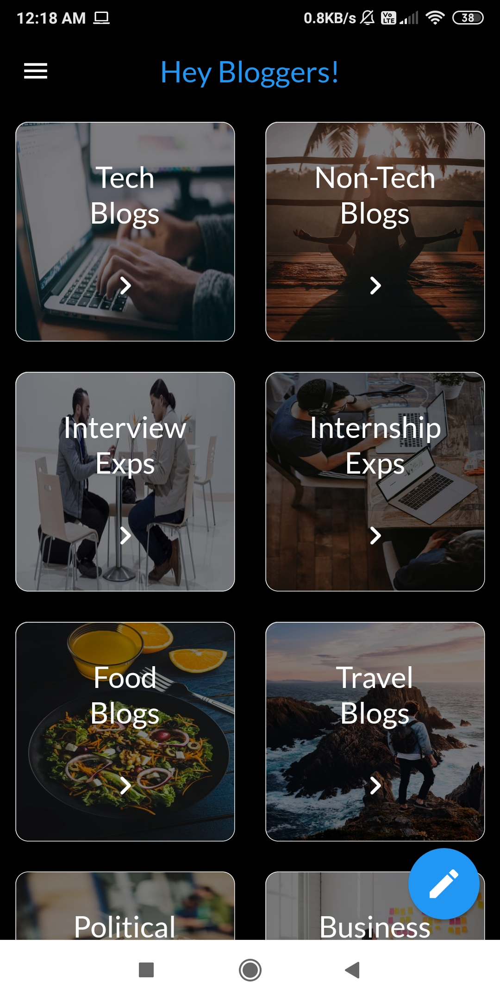
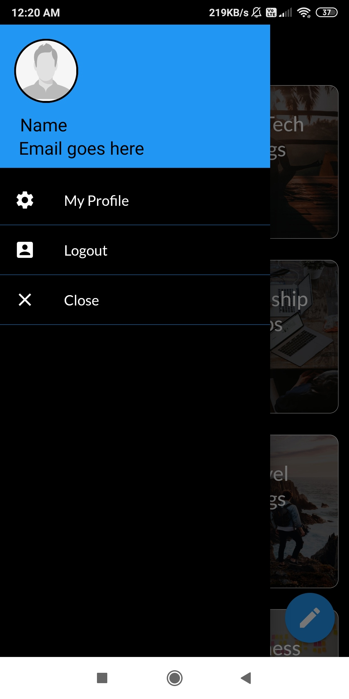
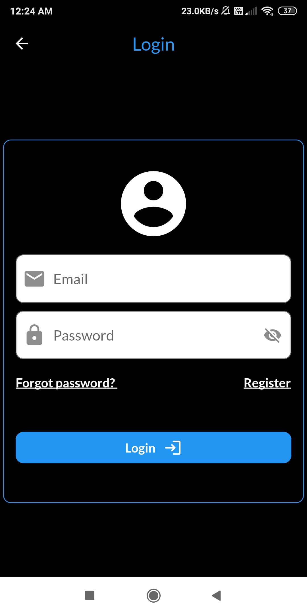
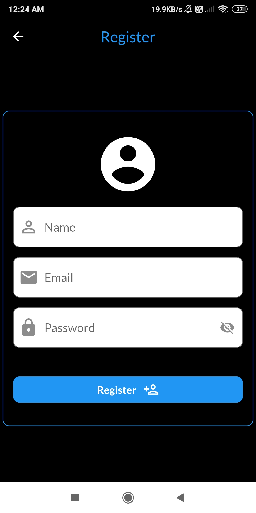

# Bloggenix
A Flutter project.
I built this App using flutter which provides the platform for blogging. User can create blog on different topic like Tech,Travel,Food,Politics,etc.User can like&save any blog for later reference.He can delete personal blog and remove saved blog. Some necessary profile settings like profile photo,name,password,contact us,rate app, etc are also implemented. Firebase is used to store data of all type.

## Features implemented in the app
<ul>
    <li>Login and Register</li>
    <li>User can create new blog and can upload it. All Blogs are public.</li>
    <ul>
        <li>User can add upto 5 photos in blog while creating. Separate text editor to write rich text. Once uploaded, any personal blog can not be changed. How ever i am thinking to implement this feature of 'change your personal blog' in future.</li>
    </ul>
    <li>8 different categorywise blog.</li>
    <ul>
        <li>Technical Blogs</li>
        <li>Non-Technical Blogs</li>
        <li>Interview Experience</li>
        <li>Internship Experience</li>
        <li>Food Blogs</li>
        <li>Travel Blogs</li>
        <li>Political Blogs</li>
        <li>Business Blogs</li>
    </ul>
    <li>User can like and save(for later references) any blog.</li>
    <li>User can rate any blog once.</li>
    <li>User Profile</li>
    <ul>
        <li> Total #personal blogs, Total #saved blogs and Total Likes</li>
        <li>change profile photo</li>
        <li>change name</li>
        <li>change password</li>
        <li>Contact Us (user can send mail to specific recepient)</li>
        <li>Rate App. User can rate app multiple time but older feedback will be overrided by new one.</li>
    </ul>
    <li> User can delete personal blog. User can remove any blog from his/her saved blog section.</li>
</ul>

## Screen Shots of App

    
         
        
        
    

    
         
        
        
    

    
         
        
        
    

    
         
        
        
    

<h2>Contributing</h2>
Pull requests are welcome. For major changes, please open an issue first to discuss what you would like to change.

